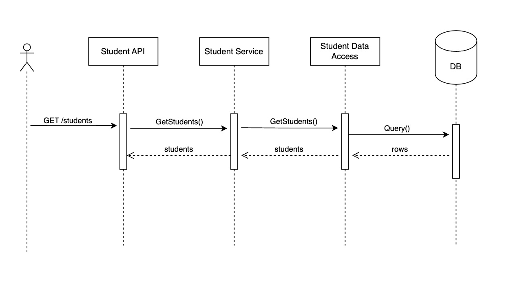

# go-service-starter

### Install dependencies
```sh
go mod download
```

### Run
```sh
go run ./
```

Verify
```sh
curl http://localhost:8080/students
```

## Run database

```sh
docker-compose up
```

# Project Structure


```
.
├── README.md
├── docker-compose.yml
├── go.mod
├── go.sum
├── main.go                       <-- Entry point
├── pkg                           <-- packages dir
│   ├── application               <-- REST API, interfaces
│   ├── data-access               <-- Data access layer, db queries
│   ├── service                   <-- Business services
│   └── utils                     <-- Utilities
└── sql                           <-- Flyway migration scripts
    └── V1__initial_tables.sql
```

